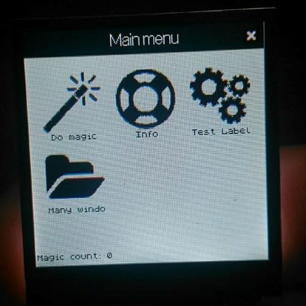
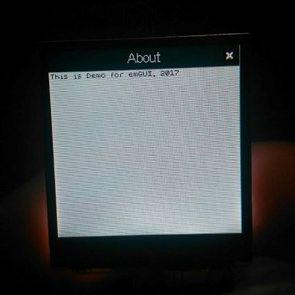

emGUI v2.0.0
=====

C/C++ GUI Library for Arduino. 

Some photos

This lib could work not only with Arduino, so we made an [example with visual studio](https://github.com/libEmGUI/emGUI-example) (will be submited soon)

// Russian 

Библиотека делает ГУЙ. Главная сущность в ней - виджет (Widget). 
Это базовая струткура, отражающая логическую единицу интерфейса, содержащая такую информацию
как расположение, размер, обработчик дейсвтия при нажатии. Она служит предком для
всех остальных сущностей: Window, Label, Button, StatusBar и т.д. 
(Вы можете описать свои сущности, если в этом есть необходимость)

Виджеты вкладываются друг в друга, образуя иерархию. Главным виджетом выступает 
едиснвтенный экземпляр структуры типа Interface, который заполняется окнами (Windows)
Окна создаются в момент вызыва функции `pxWindowCreate(eWindow)`. Функция принимает в качестве 
аргумента название окна (типа enum). Далее окно становится невидимм и вызывается функцией 
`vInterfaceOpenWindow(eWindow)`

В библиотеке реализован стек окон. В разумных пределах можно открывать сколько
угодно окон и не бояться за порядок их откртия/закрытя

Вызов функции

`bool bInterfaceCheckTouchScreenEvent(xTouchEvent *pxTouchScreenEv);` 

Приведет к вызову обработчика, который вы можете назначить на любой виджет. 

В библиотеке реализовано закрытие активного окна при нажатии на крестик в статусбаре. 
Обработчик может задаваться как в конструкторе, так и отдельной функцией (подробнее смотрите в исходном коде к библиотеке)

Getting started

Для начала работы необходимо определить виртуальные функции отрисовки примитовов:
 - Прямоугольник 
 - Вертикальная линия
 - Горизонтальная линия 
 - Символ(в библиотеке пристуствуют два шрифта)
 - Изображение 
 
В примере вы можете ознакомиться с тем, как определить эти функции
 
Вы можете также переопределить формат хранения изображений. В этом случае 
вам необходимо (!) переопределить изображения, которые используются в 
библиотеке.  А так же переопределить методы для нахождения высоты и 
ширины изображения (см файл Draw.h)

Файл opts.h опредляет значения макросов по-умолчанию (НЕ МЕНЯЙТЕ ЭТОТ ФАЙЛ!)
Для определения своих значений используйте файл emGUI_opts.h

В этом файле можно определить основные константы (таткие как размер экрана)
А так же переопределить цвета, шрифты, изображения, типы изображений  

